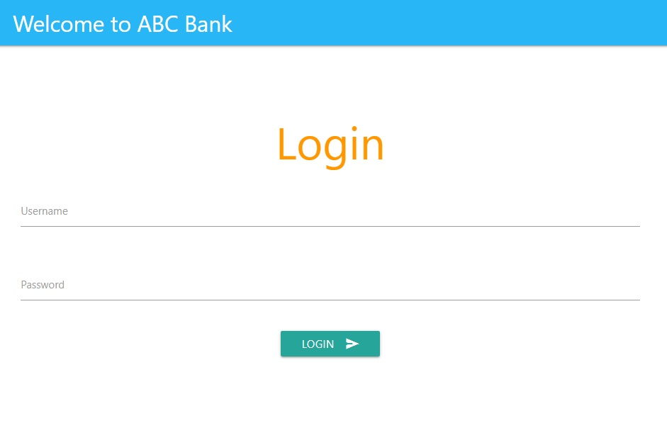
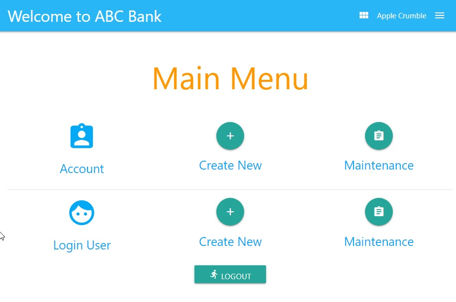
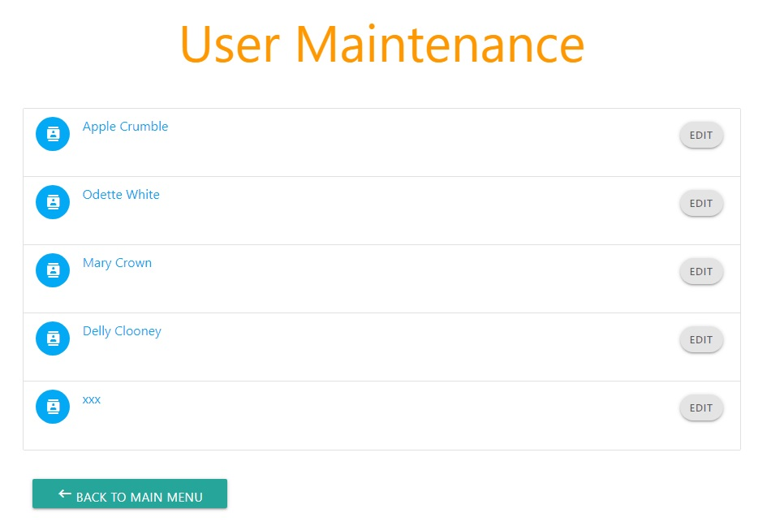
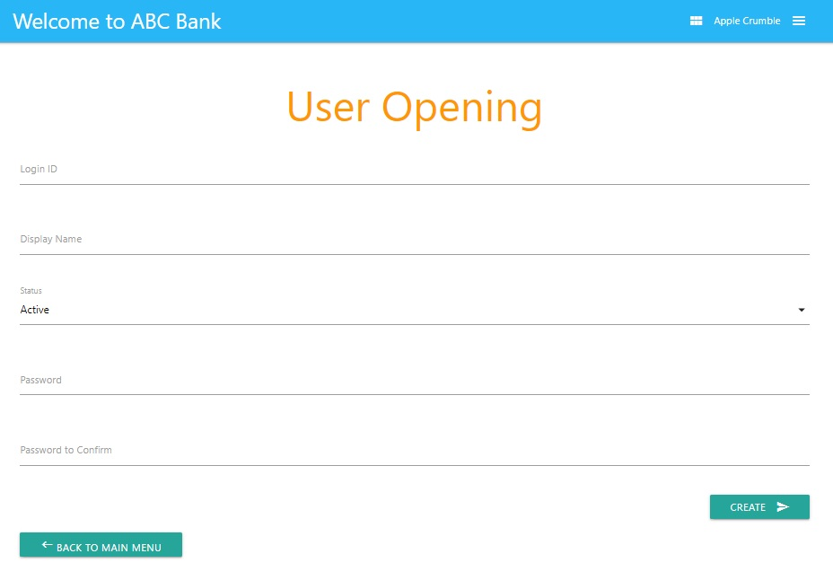
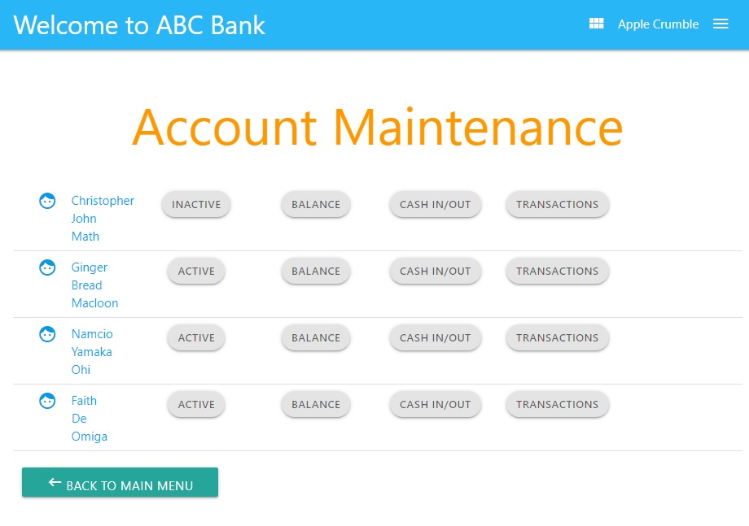
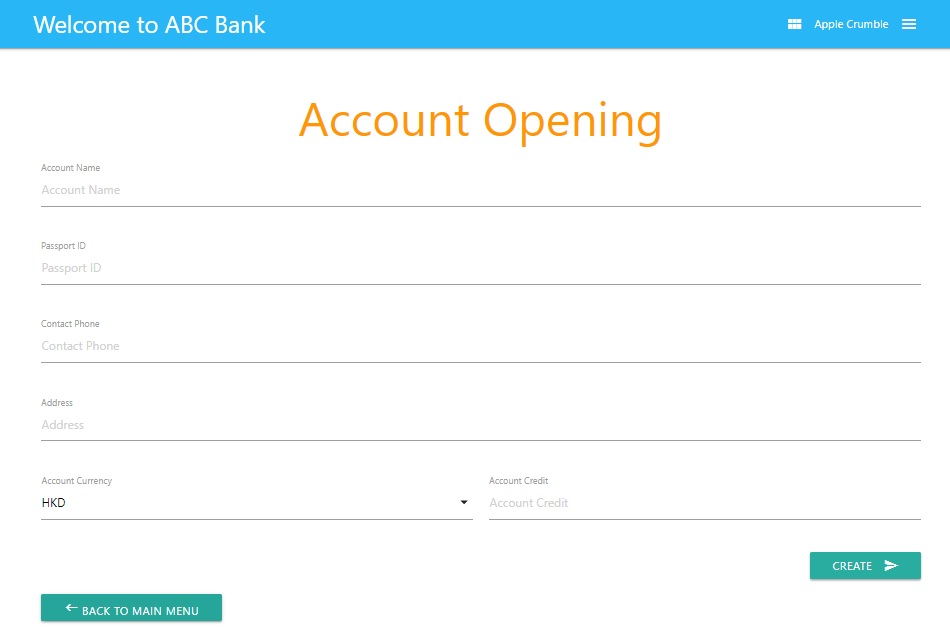

# Symfony Simple Bank Application :classical_building: :moneybag:
This project is a simple application created to handle basic financial transactions, i.e. user and account opening, cash deposit, cash withdrawal and summary of transactions.

Little Story: This project was initially developed in 2017 using PHP 7.1.9 and Symfony 3.4.1. I recently converted it to be supported by PHP 8.0.1 and Symfony 5.2.2. Some libraries are deprecrated such as `sensio/framework-extra-bundle`.

## Requirements :star:
* **[Apache Server 2](#install-apache-server-globe_with_meridians)**
<br/>*(I used Apache 2.4.41 during development)*
* **[PHP 7.2.5 or higher](#install-php-computer)**
<br/>*(I used PHP 8.0.1 during development)*
* **Symfony Framwork 5.2 or higher**
<br/>*(I used **[Composer 2.0.9](#install-composer-hammer_and_wrench)** to help downloading and managing packages and their dependencies easily.)*

## No Database Setup :floppy_disk:
The project is relying on Apache Server, Symfony PHP and Twig only. It has not yet connected to any database. Currently, I simply use CSV files in `/src/Data` to store data such as users, accounts, transactions, etc..

## Install Apache Server :globe_with_meridians:
```bash
sudo apt install -y apache2
```
You can use systemctl to start, stop, enable, reload or restart it.
```
sudo systemctl start apache2
sudo systemctl stop apache2
sudo systemctl enable apache2
sudo systemctl reload apache2
sudo systemctl restart apache2
```
Check Apache version:
```bash
apache2 -v
```
To set www-data (Apache user) as the owner of document root. By default it’s owned by the root user. Reload Apache for the change to take effect.
```bash
sudo chown www-data:www-data /var/www/ -R
sudo systemctl reload apache2
```
You can then check if the default Apache page can be viewed in browser with URL: <http://localhost>

## Install PHP :computer:
```bash
sudo apt-add-repository ppa:ondrej/php
sudo apt install php8.0
sudo apt install libapache2-mod-php8.0
sudo apt install php8.0-cli
sudo apt install php8.0-curl
sudo apt install php8.0-common
sudo apt install php8.0-mbstring
```
Enable PHP module in Apache<br>
Enable rule-based rewriting engine, so URLs can be re-mapped on the fly of requesting<br>
After all, restart Apache Web server
```bash
sudo a2enmod php8.0
sudo a2enmod rewrite
sudo systemctl restart apache2
```
Check PHP version:
```bash
sudo php -v
```
Create a PHP info page (e.g. /var/www/html/info.php), or in any folder under document root accessible by Apache.
```bash
sudo nano /var/www/html/info.php
```
Save below code into the file.
```php
<?php phpinfo(); ?>
```
You can then view it in browser with URL: <http://localhost/info.php>

## Install Composer :hammer_and_wrench:
```bash
curl -sS https://getcomposer.org/installer | sudo php -- --install-dir=/usr/local/bin --filename=composer
```
You will see below message after installation completed.
```
Composer (version 2.0.9) successfully installed to: /usr/local/bin/composer
Use it: php /usr/local/bin/composer
```

## Configure Symfony Application :receipt:
After downloading this project into `/var/www`, a few configurations are needed, e.g. set the correct permissions and give Apache2 control.
```bash
sudo chown -R www-data:www-data /var/www/symfony-material-bank-app
sudo chmod -R 755 /var/www/symfony-material-bank-app
(755 is just an example)
```
Go to the project folder.
```bash
cd /var/www/symfony-material-bank-app
```
Tell Composer to install all necessary packages and components if it can locate the composer.json file existing in the current directory.
```bash
sudo composer install
```

## Configure Apache to host the Symfony Application :gear:
Create Apahce2 site configuration file:
```bash
sudo nano /etc/apache2/sites-available/symfony-material-bank-app.conf
```
Save below settings into the file. I assume this application is accessed through port **8080**.
```aconf
<VirtualHost *:8080>
     ServerAdmin webmaster@localhost
     DocumentRoot /var/www/symfony-material-bank-app/public

     <Directory /var/www/symfony-material-bank-app/public/>
          Options FollowSymlinks
          AllowOverride None
          Require all granted
          Allow from All
        
        <IfModule mod_rewrite.c>
                Options -MultiViews
                RewriteEngine On
                RewriteCond %{REQUEST_FILENAME} !-f
                RewriteRule ^(.*)$ index.php [QSA,L]
        </IfModule>
     </Directory>

     ErrorLog ${APACHE_LOG_DIR}/error-bank-app.log
     CustomLog ${APACHE_LOG_DIR}/access-bank-app.log combined
</VirtualHost>
```
Update Apache port config file.
```bash
sudo nano /etc/apache2/ports.conf
```
Add new listening port into the file.
```aconf
Listen 8080
```
Enable the new VirtualHost config and restart Apache to make it effective.
```bash
sudo a2ensite symfony-material-bank-app.conf
sudo systemctl restart apache2
```

## Usage :v:
Finally, you can access the application at URL <http://localhost:8080> or <http://localhost:8080/login>. :sunglasses:

## Sceenshots :national_park:







# Reference Websites :thumbsup:
* https://httpd.apache.org/
* https://www.php.net/
* https://symfony.com/doc/5.2/setup.html
* https://symfony.com/doc/5.2/setup/symfony_server.html
* https://symfony.com/doc/current/page_creation.html
* https://symfony.com/doc/current/security/form_login_setup.html
* https://symfonycasts.com/screencast/symfony-security/login-form-authenticator
* https://getcomposer.org/
* https://www.linuxbabe.com/ubuntu/install-lamp-stack-ubuntu-20-04-server-desktop
* https://websiteforstudents.com/how-to-install-symfony-5-framework-on-ubuntu-18-04-16-04-with-apache2/
* https://www.scalyr.com/blog/getting-started-quickly-symfony-logging

